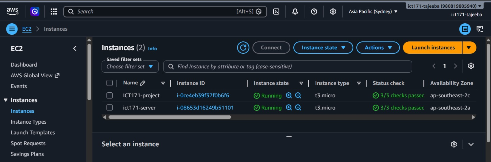
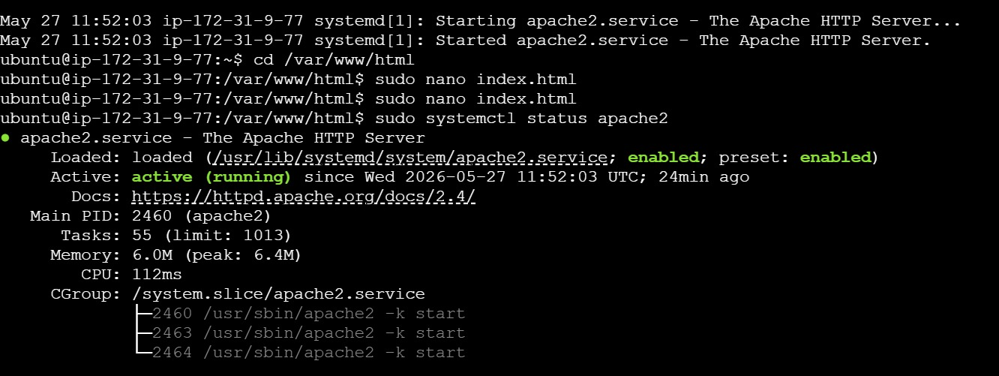
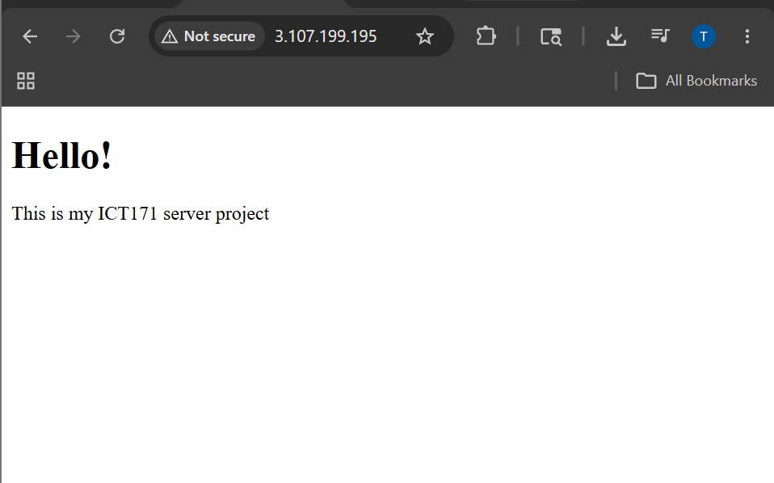
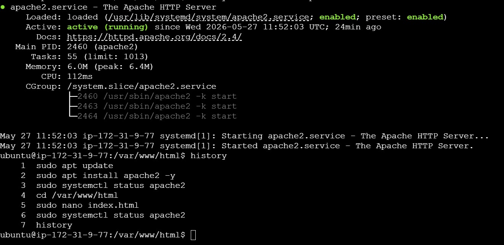
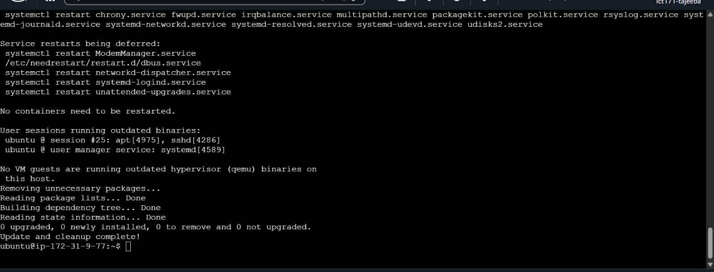
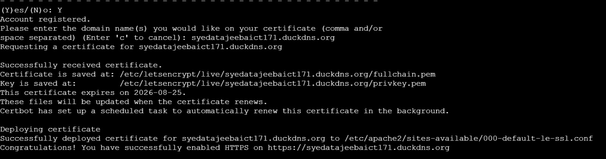

# ICT171 Cloud Server Project

## Student Information
Name: Syeda Tajeeba  
Student ID: 35770732

---

## Project Overview
This project involves creating and configuring a cloud-based Linux web server using AWS EC2.

The server hosts a basic website using Apache2 and is publicly accessible through its IPv4 address.

---

## Server Information

## Live Website
[http://3.107.199.195](https://syedatajeebaict171.duckdns.org)

Public IPv4 Address:
3.107.199.195

Instance Type:
t3.micro

Operating System:
Ubuntu Server 24.04 LTS

Web Server:
Apache2

---

## Commands Used

```bash
sudo apt update
sudo apt install apache2 -y
sudo systemctl status apache2

cd /var/www/html

sudo nano index.html
```

---

## Website

The website was successfully hosted online using Apache2 on an AWS EC2 instance.

Current webpage:

“Hello! This is my ICT171 cloud server project.”

---

## Screenshots

- EC2 instance running
- Apache status active (running)
- Website hosted publicly
- Command history

(Screenshots will be uploaded later.)
---

## Project Screenshots

### EC2 Instance Running


### Apache Status


### Website Hosted Publicly


### Command History


---

## HTTPS / SSL Enabled

The website has been secured using Let's Encrypt SSL certificates through Certbot.

HTTPS Link:
https://syedatajeebaict171.duckdns.org

### HTTPS Setup Evidence


### Script Output Evidence

